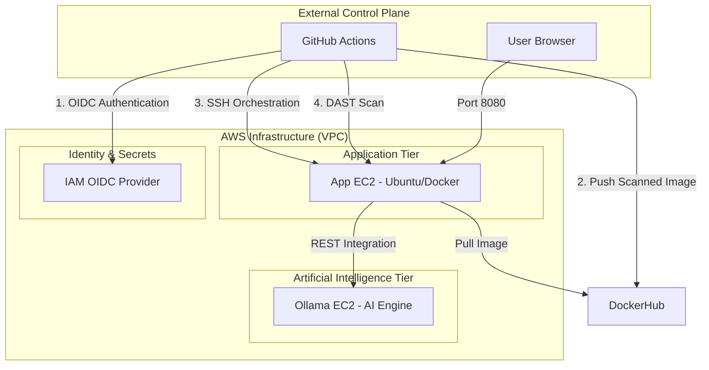

<div align="center"> 

# DevSecOps Banking Application

A high-performance, containerized financial platform built with Spring Boot 3, Java 21, and integrated Contextual AI. This project implements a secure "DevSecOps Pipeline" using GitHub Actions, OIDC authentication.

[](https://www.oracle.com/java/technologies/javase/jdk21-archive-downloads.html)
[](https://spring.io/projects/spring-boot)
[](.github/workflows/devsecops.yml)
[](#phase-3-security-and-identity-configuration)

</div>


---

## Technical Architecture

The application is deployed across a multi-tier, segmented AWS environment. The control plane leverages GitHub Actions with integrated security gates at every stage.


---

## Security Pipeline (DevSecOps Pipeline)

The CI/CD pipeline enforces **9 sequential security gates** before any code reaches production:

| Gate | Name | Tool | Purpose |
| :---: | :--- | :--- | :--- |
| 1 | Secret Scan | Gitleaks | Scans entire Git history for leaked secrets |
| 2 | Lint | Checkstyle | Enforces Java Google-Style coding standards |
| 3 | SAST | Semgrep | Scans Java source code for security flaws and OWASP Top 10 |
| 4 | SCA | OWASP Dependency Check (first time run can take more than 30+ minutes) | Scans Maven dependencies for known CVEs |
| 5 | Build | Maven | Compiles and packages the application |
| 6 | Container Scan | Trivy | Scans the Docker image for OS and library vulnerabilities |
| 7 | Push | DockerHub | Pushes the image only after Trivy passes |
| 8 | Deploy | SSH / Docker Compose | Automated deployment to AWS EC2 |
| 9 | DAST | OWASP ZAP | Dynamic attack surface scanning on live app |

---

## Technology Stack

- **Backend Framework**: Java 21, Spring Boot 3.4.1
- **Security Strategy**: Spring Security, IAM OIDC, Secrets Manager
- **Persistence Layer**: MySQL 8.0 (Dev/Test Tier)
- **AI Integration**: Ollama (TinyLlama)
- **DevOps Tooling**: Docker, DockerHub, Docker Compose, GitHub Actions, AWS CLI, jq
- **Infrastructure**: Amazon EC2, Amazon VPC

---

## Implementation Phases

### Phase 1: AWS Infrastructure Setup

- Deploy Ubuntu 22.04 instances

- Bank-app (t3.medium)
- Ollama (t3.large with 20gb)

1. **Application Server (BankApp)**:

- Run on both servers
  
      ```bash
      #!/bin/bash

      sudo apt update 
      sudo apt install -y docker.io docker-compose-v2 jq mysql-client
      sudo usermod -aG docker ubuntu
      sudo newgrp docker
      sudo snap install aws-cli --classic
      ```

3. **AI Engine Tier (Ollama)**:

   - Automate initialization using the [ollama-setup.sh](scripts/ollama-setup.sh) script via EC2 User Data.
    
      

   - Verify the AI engine is responsive and the model is pulled in `AI engine EC2`:

     ```bash
     ollama list
     ```

      

   - Open Inbound Port `11434` from the Application EC2 Security Group.

      > Better to give `name` to Security Group created.
    
      

---

#### 2. GitHub Repository Secrets
Configure the following Action Secrets within your GitHub repository settings:

| Secret Name | Description |
| :--- | :--- |
| `AWS_REGION` | The AWS region where resources are deployed |
| `AWS_ACCOUNT_ID` | Your 12-digit AWS account number |
| `BANKAPP_EC2_HOST` | The public IP address of the Application EC2 |
| `Ollama_URL` | The private IP address of the Ollama EC2 |
| `EC2_USER` | The SSH username (default is `ubuntu`) |
| `EC2_SSH_KEY` | The content of your private SSH key (`.pem` file) |
| `DOCKERHUB_USERNAME` | The username of your DockerHub |
| `DOCKERHUB_TOKEN` | The token of DockerHub to Push/pull Docker images |
| `NVD_API_KEY` | Free API key from [nvd.nist.gov](https://nvd.nist.gov/developers/request-an-api-key) for OWASP SCA scans |

> **Note**: The `NVD_API_KEY` raises the NVD API rate limit from ~5 requests/30s to 50 requests/30s, reducing the OWASP Dependency Check scan time from 30+ minutes to under 8 minutes. Without it the SCA job will time out.

#### Obtaining the NVD API Key

**Step 1: Request the API Key**
- Go to [https://nvd.nist.gov/developers/request-an-api-key](https://nvd.nist.gov/developers/request-an-api-key).
- Enter your `Organzation name`, `email address`, and select `organization type`.
- Accept **Terms of Use** and Click **Submit**.

   

**Step 2: Activate the API Key**
- Check your email inbox for a message from `nvd-noreply@nist.gov`.

   

- Click the **activation link** in the email.
- Enter `UUID` provided in email and Enter `Email` to activate
- The link confirms your key and marks it as active.  

   

**Step 3: Get the API Key**
- After clicking the activation link, the page will generate your API key.
- Copy and save it securely.

   

**Step 4: Add as GitHub Secret**
- Go to your repository on GitHub.
- Navigate to **Settings** → **Secrets and variables** → **Actions** → **New repository secret**.
- Name: `NVD_API_KEY`
- Value: Paste the copied API key.
- Click **Add Secret**.


---

## Continuous Integration and Deployment

The DevSecOps lifecycle is orchestrated through the [DevSecOps Main Pipeline](.github/workflows/devsecops-main.yml), which securely sequences three modular workflows: [CI](.github/workflows/ci.yml), [Build](.github/workflows/build.yml), and [CD](.github/workflows/cd.yml). Together they enforce **9 sequential security gates** before any code reaches production. Every `git push` to the `main` or `devsecops` branch triggers the full pipeline automatically.

| Gate | Job | Tool | Action |
| :---: | :--- | :--- | :--- |
| 1 | `gitleaks` | Gitleaks | **Strict**: Fails if any secrets are found in history. |
| 2 | `lint` | Checkstyle | **Audit**: Reports style violations but doesn't block (Google Style). |
| 3 | `sast` | Semgrep | **Strict**: Scans code for vulnerabilities. Fails on findings. |
| 4 | `sca` | OWASP Dependency Check | **Strict**: Fails if any dependency has CVSS > 7.0. |
| 5 | `build` | Maven | Standard build and test stage. |
| 6 | `image_scan` | Trivy | **Strict**: Scans Docker image layers. Fails on any High/Critical CVE. |
| 7 | `push_to_DockerHub` | DockerHub | Pushes the verified image to DockerHub. |
| 8 | `deploy` | SSH / Docker Compose | Fetches secrets from .env and recreates the container. |
| 9 | `dast` | OWASP ZAP | **Audit Mode**: Comprehensive scan that reports findings as artifacts, but does not block the pipeline. |

All scan reports (OWASP, Trivy, ZAP) are uploaded as downloadable **Artifacts** in each GitHub Actions run, You can look into the **Artifacts**.

- CI/CD

   

- Image

   
 

- Artifacts

   
   
---

## Operational Verification

- **Process Status**: `docker ps`

  

- **Application Working**:

  

---

<div align="center">

Happy Learning!

**TrainWithShubham**  

</div>
